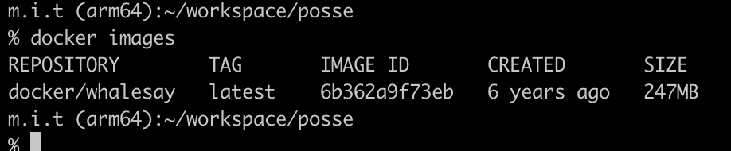

# 1問目

## この課題の目的

DockerのimageをDocker Hubから取得できるようになりましょう

## 問題

docker/whalesayのDocker imageを手元にダウンロードしてみてください

```
docker pull ? 
```

？に適切なものを入れて実行してください


## ゴール

`docker images` コマンドを打った時に以下のようにdokcer/whalesayのimageがあればokです

  
