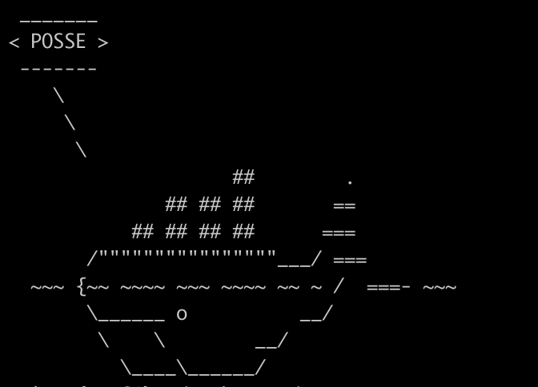
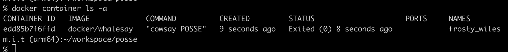

# 2問目

## この課題の目的

imageからcontainerを作成しコマンドを実行できる

## 問題

containerはimageを元に作成されます
1問目でdocker/whalesayのimageを取得したので、docker/whalesayのimageからcontainerを作成すると同時にcontainerを起動し、コマンドを実行しましょう

```
docker ? docker/whalesay cowsay POSSE
```

？に適切なものを入れて実行してください

## ゴール
以下のようにクジラがPOSSEと言う

  


コマンドを実行したのちに `docker container ls -a`を実行すると、STATUSがExitedのdocker/whalesayのcontainerがあること
  
