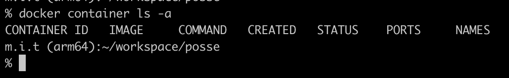
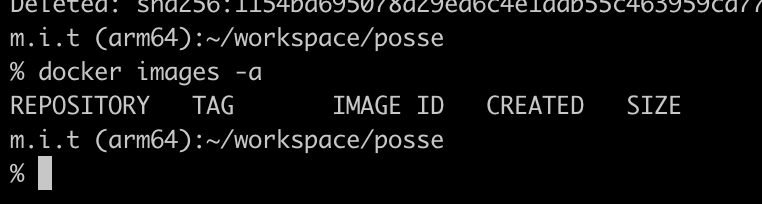

# 3問目

## この課題の目的

作成したimageとcontainerを削除してください

## 問題

1問目、2問目で用意したimageとcontainerは使わないので削除してみましょう

containerを削除する
```
docker ? CONTAINER ID
```

？に適切なものを入れて実行してください
※ CONTAINER IDは各自異なる値が入ります

imageを削除する

```
docker ? docker/whalesay
```

？に適切なものを入れて実行してください

## ゴール

`docker container ls -a` コマンドを打った時に以下のようにdokcer/whalesayのcontainerがないこと

  

`docker images -a` コマンドを打った時に以下のようにdokcer/whalesayのimageがないこと

  
