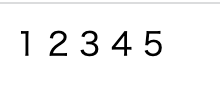

# 17週目ミニドリル 2問目

# 事前確認

1. 1問目がクリアしていること
2. localhost:8080にアクセスしてください。以下のように数字が表示されることを確認してください。

  

3. docker compose downしてください

# 問題

現在localhost:8080でアクセスできるが、localhost:3000でアクセスできるようにしてください。
※アクセスできるとは先ほどの数字が画面に表示されることです