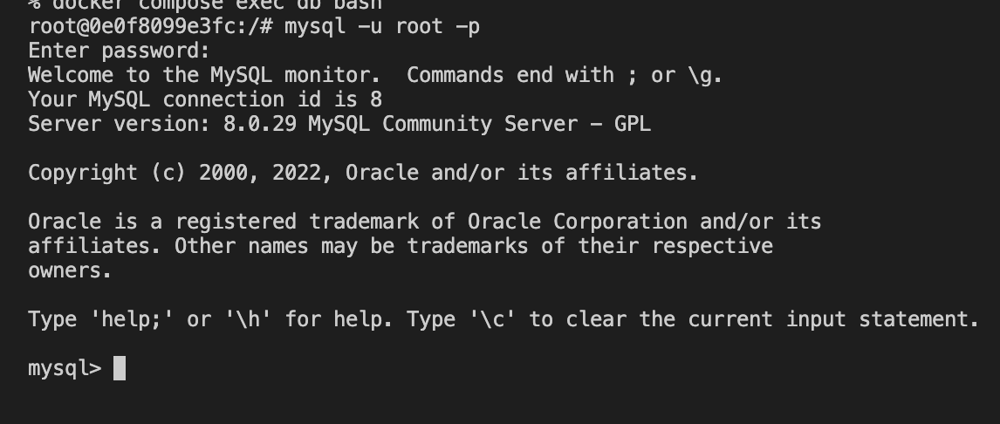

# 17週目ミニドリル 3問目

## 問題

dbコンテナにアクセスしてmysqlに接続してください

コンテナに入るコマンド
```
docker compose ? db bash
```
? に適切なコマンド入れて実行してください

### 終了条件
- dbコンテナに入れたこと
- dbコンテナに入り、 `mysql -u root -p` を実行しmysqlにアクセスできること
  - アクセスできたら以下の画像ような表示がされます

  

### 注意点
mysqlのpasswordはdocker-compose.ymlの22行目にて設定しています