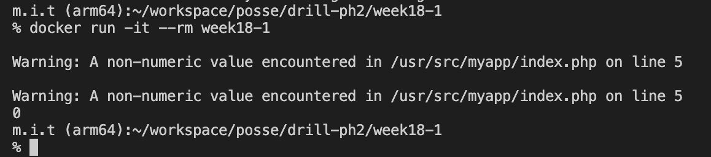
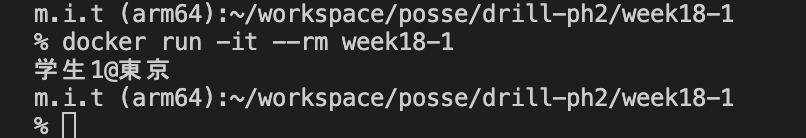

# 18週目ミニドリル 1問目

## 問題

正しく文字列と変数を連結してください。

```
docker build -t week18-1 .
```

でbuildしたのちに

```
docker run -it --rm week18-1
```

を実行してみてください

  

上記のようにwarningと共に `0` と出力されています。



上記のように `学生1@東京` と表示されるように修正してください

### 終了条件
- `学生1@東京` と表示されること

### 注意点

index.phpの内容を書き換えたら `docker build -t week18-1 .`を実行しないと `docker run -it --rm week18-1`を実行しても変更が反映されません。
