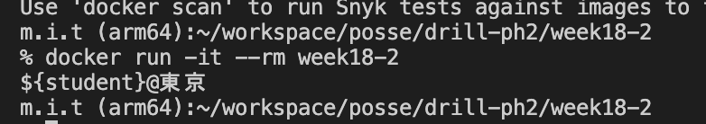
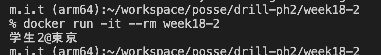

# 18週目ミニドリル 2問目

## 問題

文字列内の変数を展開してください

```
docker build -t week18-2 .
```

でbuildしたのちに

```
docker run -it --rm week18-2
```

を実行してみてください

  

 `${student}@東京` と出力されています。

  

上記のように `学生2@東京` と表示されるように修正してください

### 終了条件
- `学生2@東京` と表示されること

### 注意点

index.phpの内容を書き換えたら `docker build -t week18-2 .`を実行しないと `docker run -it --rm week18-2`を実行しても変更が反映されません。
