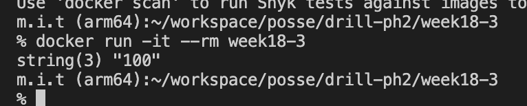
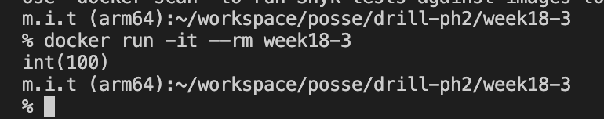

# 18週目ミニドリル 3問目

## 問題

キャストしたい

```
docker build -t week18-3 .
```

でbuildしたのちに

```
docker run -it --rm week18-3
```

を実行してみてください

  

 `string(3) "100"` と出力されています。

  

上記のように `int(100)` と表示されるように修正してください

index.phpの5行目の `?` 部分に適切なphpの処理を書いてください

### 終了条件
- `int(100)` と表示されること

### 注意点

index.phpの内容を書き換えたら `docker build -t week18-3 .`を実行しないと `docker run -it --rm week18-3`を実行しても変更が反映されません。
