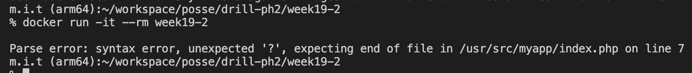

# 19週目ミニドリル 1問目

## 問題

エラーを解消し、if文を使ってみる

```
docker build -t week19-2 .
```

でbuildしたのちに

```
docker run -it --rm week19-2
```

を実行してみてください

  

 エラーが出力されています。

  

上記のように `falseと評価されました` と表示されるように修正してください

index.phpの７行目の `?` 部分に適切なphpの処理を書いてください

### 終了条件
- `falseと評価されました` と表示されること

