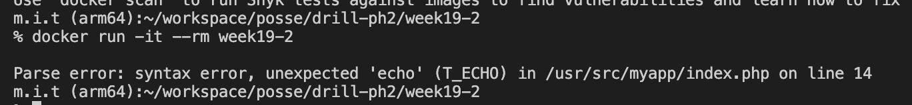
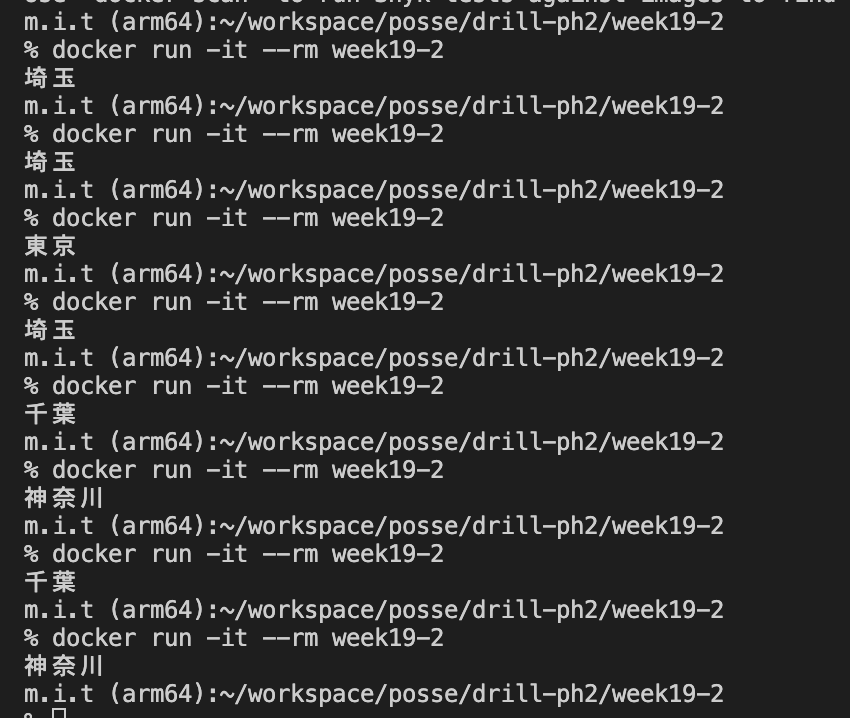

# 19週目ミニドリル 2問目

## 問題

エラーを解消し、switch文を使ってみる

```
docker build -t week19-2 .
```

でbuildしたのちに

```
docker run -it --rm week19-2
```

を実行してみてください

  

 エラーが出力されています。

  

上記のようにランダムで都道府県が表示されるように修正してください

### 終了条件
- ランダムで都道府県が表示されること

