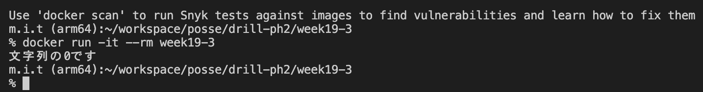
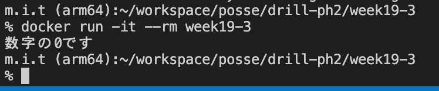

# 19週目ミニドリル 3問目

## 問題

ifの条件節を修正したい

```
docker build -t week19-3 .
```

でbuildしたのちに

```
docker run -it --rm week19-3
```

を実行してみてください

  

 `文字列の0です` と出力されています。

  

上記のように `数字の0です` と表示されるようにindex.phpの5行目を修正してください

### 終了条件
- `数字の0です` と表示されること

### 注意点

$numberの値を変更しないでください