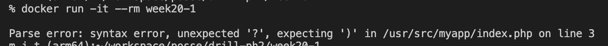
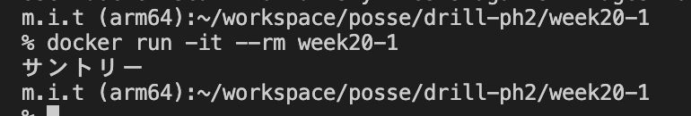

# 20週目ミニドリル 1問目

## 問題

意図した文言だけ切り抜きたい

```
docker build -t week20-1 .
```

でbuildしたのちに

```
docker run -it --rm week20-1
```

を実行してみてください

  

 エラーが出力されています。

  

上記のように `サントリー` と表示されるようにindex.phpの3行目の?に適切な値入れて修正してください

### 終了条件
- `サントリー` と表示されること