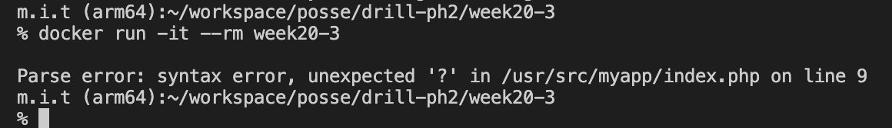
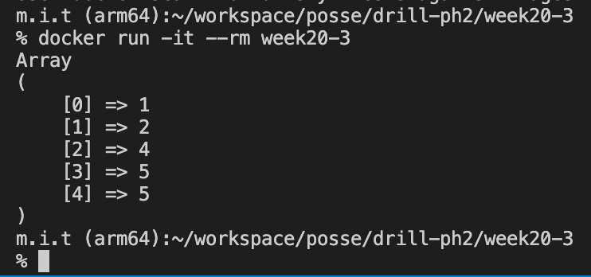

# 20週目ミニドリル 3問目

## 問題

ifの条件節を修正したい

```
docker build -t week20-3 .
```

でbuildしたのちに

```
docker run -it --rm week20-3
```

を実行してみてください

  

 エラーが出力されています。

  

上記の画像のように四捨五入された数字が表示されるようにindex.phpの9行目の?を修正してください

### 終了条件
  - 画像のように四捨五入された数字が表示されること
