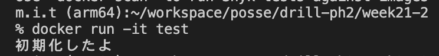

# 21週目ミニドリル 2問目

## 問題

インスタンスを初期化する際に値をセットしたい

index.phpの13行目に適切な処理を記入してインスタンスを初期化してください。

index.phpの9行目に適切な処理を記入してインスタンスを初期化した際に値がセットされるようにしてください。

上記完了後に、実行すると以下のように`初期化したよ`と表示されるようにしてください

  

### 終了条件
  - 「初期化したよ」と表示されること
