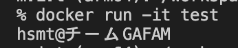
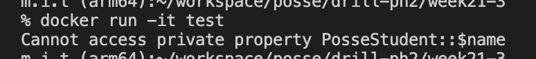

# 21週目ミニドリル 3問目

## 問題

適切なアクセス修飾子を設定したい。

現在、実行すると以下のように表示されます。

  

index.phpの10行目でアクセス修飾子を適切なものに変更してください。

正しく修正すれば、以下のように`Cannot access private property PosseStudent::$name`と表示されます

  

### 終了条件
  - Cannot access private property PosseStudent::$nameと表示されること
