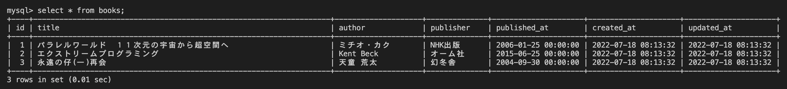

# 25週目ミニドリル 1問目

## 問題

SQLでテーブルを作成してください。

init.sqlの4行目の?部分それぞれに適切な句を入れてください

### 終了条件
?部分それぞれに適切な句を入れ、imageをbuildする
buildしたimageからcontainerを立ち上げる
containerのmysqlに接続し、 `select * from books;` を実行する。
実行した結果、以下のようにbooks一覧が表示されれば完了。

  
