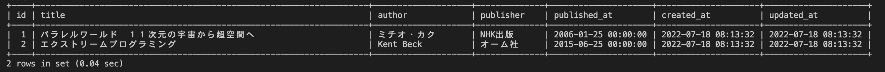

# 25週目ミニドリル 2問目

## 問題

2005年以降に出版された本のみを抽出してください

`SELECT * FROM books WHERE ? > "2005-01-01";`
上記SQLの?部分に適切な句を入れてください

### 終了条件
week25-1で立ち上げたcontainerのmysqlに接続する。

?部分に適切な句を入れ、そのSQLを実行する
実行した結果、以下のようにidが1と2のレコードだけがが表示されれば完了。

  

