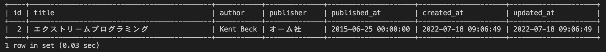

# 25週目ミニドリル 3問目

## 問題

本の名前にプログラミングが入っている本のみを抽出してください

`SELECT * FROM books WHERE title ? "%プログラミング%";`
上記SQLの?部分に適切な句を入れてください

### 終了条件
week25-1で立ち上げたcontainerのmysqlに接続する。

?部分に適切な句を入れ、そのSQLを実行する
実行した結果、以下のようにidが2のレコードだけがが表示されれば完了。

  

