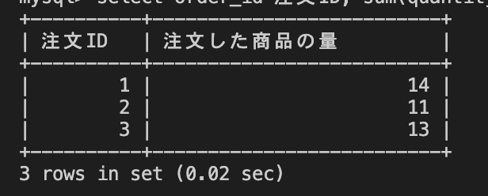

# 26週目ミニドリル 1問目

## 問題

注文ごと商品の量を算出してください

`select order_id 注文ID, ? 注文した商品の量 from order_details group by order_id;`
上記sqlの?部分に適切な処理を入れてください

### 終了条件
containerを立ち上げ、containerのmysqlに接続してください
mysqlでSQLを実行した結果、以下のように表示されれば完了。

  
