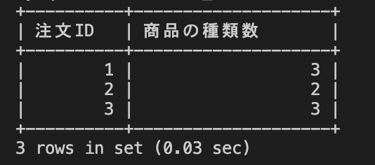

# 26週目ミニドリル 2問目

## 問題

注文ごとに商品の種類が何種類かを算出してください

`select order_id 注文ID, ？ 商品の種類数 from order_details group by order_id;`
上記sqlの?部分に適切な処理を入れてください

### 終了条件
week26-1で立ち上げたcontainer内でmysqlに接続してください
mysqlでSQLを実行した結果、以下のように表示されれば完了。

  
