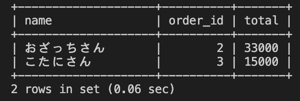

# 27週目ミニドリル 2問目

## 問題

注文者ごとの注文代金で、注文代金が10000円以上の一覧を算出してください

```
select orders.name, order_id, sum(price * quantity) total from order_details 
join orders on orders.id = order_details.order_id
group by order_id
? total > 10000
```
上記sqlの?部分に適切な処理を入れてください

### 終了条件
week27-1で立ち上げたcontainer内でmysqlに接続してください
mysqlでSQLを実行した結果、以下のように表示されれば完了。

  
