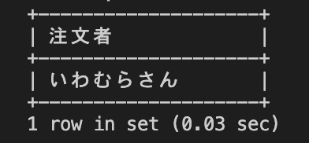

# 27週目ミニドリル 3問目

## 問題

注文(orders)テーブルにデータを保存はできたものの、バグでその注文の注文詳細を注文詳細(order_details)テーブルに保存することに失敗しました。
注文詳細が紐づかない注文テーブルのゴミデータを抽出したい

```
select orders.name 注文者 from orders 
where ? (
    select * from order_details where order_details.order_id = orders.id
    )
```
上記sqlの?部分に適切なサブクエリを入れてください

### 終了条件
week27-1で立ち上げたcontainer内でmysqlに接続してください
mysqlでSQLを実行した結果、以下のように表示されれば完了。

  
