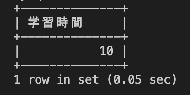

# 29週目ミニドリル 2問目

## 問題

2022年7月の小谷さんの学習時間の総和を算出してください

`select sum(hours) 学習時間 from studies where ? and ?;`
上記sqlの?部分に適切な処理を入れてください

### 終了条件
29-1で立ち上げたcontainerのmysqlに接続してください
mysqlでSQLを実行した結果、以下のように表示されれば完了。

  
