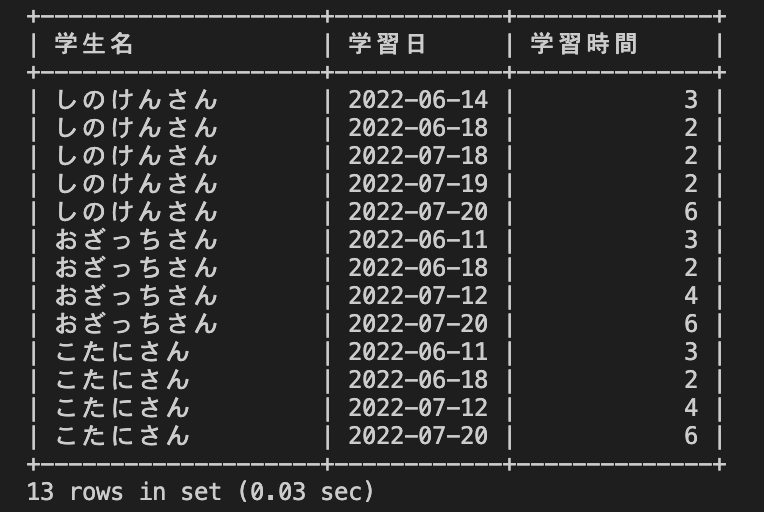
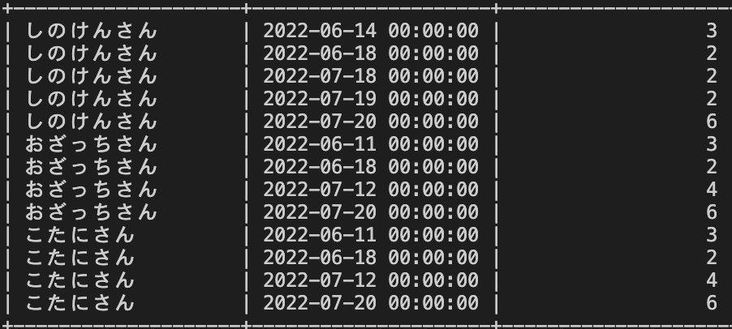

# 30週目ミニドリル 1問目

## 問題

学生名、日付ごとの学習時間を算出してください

`select students.name 学生名, ? 学習日, sum(studies.hours) 日毎の学習時間 from students join studies on studies.student_id = students.id group by 学習日, name;`
上記sqlの?部分に適切な処理を入れてください

### 終了条件
containerを立ち上げ、containerのmysqlに接続してください
mysqlでSQLを実行した結果、以下のように表示されれば完了。

  

下画像のように学習日の後ろに00:00:00がつかないようにしてください
  
