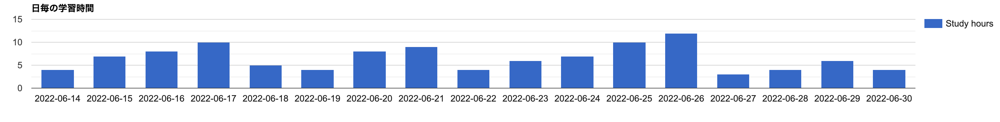

# 32週目ミニドリル

## 問題

日付ごとの学習時間をチャートに表示してください

src/index.phpのL50~L52のに?が3ヶ所あります。
それぞれに適切な処理を記述して、以下の画像のようなチャートを表示してください

  

### 終了条件
コンテナを立ち上げ、localhost:8080にアクセスし、上記画像のようなチャートが表示されること
X軸は日付
Y軸は日毎の総学習時間
